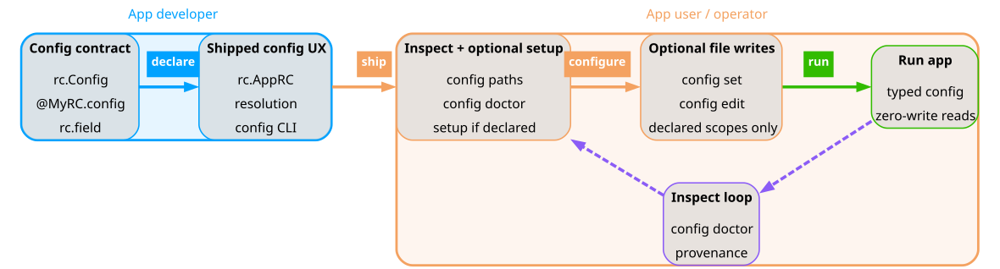
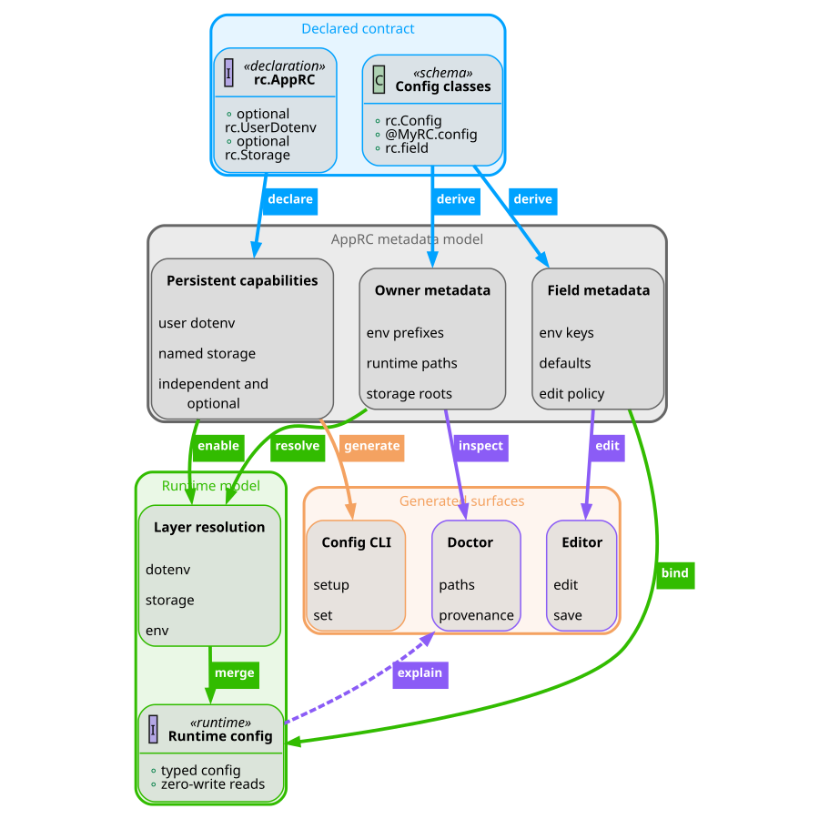

# `apprc`: Application Runtime Config

AppRC is for Python applications that need configuration to be explicit,
inspectable, and pleasant to operate. Instead of spreading environment
variables, dotenv files, setup commands, and diagnostics across unrelated code,
you declare the runtime contract once and let AppRC build the surrounding
workflows from that metadata.

The three strongest parts:

- **Typed config contracts:** declare application settings once with
  `EnvConfig`, `env_field(...)`, and `@env_owner(...)`.
- **Deterministic runtime config:** load layered dotenv files predictably while
  keeping normal runtime reads and diagnostics zero-write.
- **Generated operator UX:** mount ready-made Typer `config` commands and open
  the same contract in the Textual editor.

<p align="center">
  
</p>

<p align="center">
  <strong>Fig. 1 - AppRC Graphical Abstract:</strong>
  AppRC lets developers ship one typed config contract with generated setup,
  diagnostics, editing, and runtime config workflows.
</p>

> [!NOTE]
> For the full system model, see
> [docs/Explanations.md](docs/Explanations.md). For exact public names and
> command references, see [docs/References.md](docs/References.md).

<br>

## Table Of Contents

1. [`apprc`: Application Runtime Config](#apprc-application-runtime-config)
   1. [Table Of Contents](#table-of-contents)
2. [Installation](#installation)
3. [Quickstart](#quickstart)
4. [How AppRC Works](#how-apprc-works)
   1. [Mental Model](#mental-model)
   2. [Capability Layers](#capability-layers)
   3. [Runtime Precedence](#runtime-precedence)
5. [Generated Workflows](#generated-workflows)
   1. [Config CLI](#config-cli)
   2. [Setup And Diagnostics](#setup-and-diagnostics)
   3. [Optional Logging](#optional-logging)
6. [More Documentation](#more-documentation)
   1. [Detailed Manual](#detailed-manual)
   2. [Development](#development)

<br>

<br>


Install AppRC, declare the runtime contract, and mount the generated `config`
commands in your Typer application.

<br>

# Installation

```shell
python -m pip install apprc
```

Install optional structured logging support when your app calls
`setup_logging()`:

```shell
python -m pip install "apprc[logging]"
```

AppRC supports Python 3.12 and newer.

> [!NOTE]
> For installation and first-setup recipes, see
> [docs/How-To-User-Guides.md](docs/How-To-User-Guides.md). Optional logging
> APIs are listed in
> [docs/References.md#optional-logging-apis](docs/References.md#optional-logging-apis).

<br>

# Quickstart

Declare typed config sections with `EnvConfig`, `@env_owner`, and
`env_field(...)`:

```python
from pathlib import Path

from apprc import AppConfigKit, EnvConfig, env_field, env_owner


@env_owner(
    key="app",
    title="App",
    env_prefix="MYAPP_",
    rc_path=("app",),
)
class MyAppEnv(EnvConfig):
    storage_root: Path = env_field(
        "STORAGE",
        editable=False,
        required=True,
        title="Storage root",
    )
    profile: str = env_field(
        "PROFILE",
        default="default",
        title="Profile",
        explanation_short="Named runtime profile.",
    )
    access_token: str = env_field(
        "ACCESS_TOKEN",
        required=True,
        secret=True,
        title="Access token",
    )


APP_CONFIG = AppConfigKit.storage_only(
    app_name="myapp",
    display_name="My App",
    config_package="myapp.config",
    envs=(MyAppEnv,),
)
```

Add packaged defaults in `myapp/config/.env.shared`:

```dotenv
MYAPP_PROFILE="default"
```

Bootstrap your app before constructing runtime config objects:

```python
import typer

from apprc.cli import mount_config_cli

from myapp.config import APP_CONFIG, MyAppEnv

app = typer.Typer()
mount_config_cli(app, APP_CONFIG)


@app.command()
def run() -> None:
    cfg = MyAppEnv()
    typer.echo(f"profile={cfg.profile}")
```

`mount_config_cli(...)` adds the standard AppRC host-level options, performs runtime
bootstrap for commands that need resolved config, and mounts the generated
`config` command group. Apps with custom runtime state can pass
`state_type=...` and `state_factory=...`; tests or lazy-forwarding CLIs can pass
`args_provider=...` with tokens shaped like `CliArgvProvider`. Use
`config_group_name=...` only when the generated group should not be named
`config`.
Apps that own their host callback and extra options can use `ConfigCliBridge`
as the composable middle layer: the app builds its runtime state, while AppRC
owns config command mounting, skip policy, context storage, and state
validation.

> [!NOTE]
> For the step-by-step integration guide, see
> [docs/How-To-User-Guides.md#2-integrate-apprc](docs/How-To-User-Guides.md#2-integrate-apprc).
> For the exact import surface, see
> [docs/References.md#public-interfaces](docs/References.md#public-interfaces).

<br>

<br>

# How AppRC Works

AppRC starts from one declared contract, then uses that contract to load
runtime values, inspect configuration health, write explicit setup files, and
generate user-facing configuration tools.

|  |
|:--:|
| **Fig. 2 - One Contract, Many Workflows:** AppRC reuses the same contract metadata for runtime loading, provenance, diagnostics, generated CLI commands, and the editor. |

<br>

## Mental Model

AppRC has one contract and several workflows built from it.

| Concept | Meaning |
| --- | --- |
| Config field | One typed setting declared with `env_field(...)`. |
| Config owner | A related group of fields declared by `@env_owner(...)`. |
| App config kit | The app-level contract that selects supported persistence layers. |
| Bootstrap | A startup step that merges dotenv layers into this Python process. |
| Generated CLI | A reusable Typer `config` command group for inspection and edits. |
| Editor | A Textual view over the same owners, fields, and dotenv layers. |

> [!NOTE]
> For the deeper architecture behind owners, fields, capability layers,
> provenance, and the zero-write policy, see
> [docs/Explanations.md#3-runtime-config-model](docs/Explanations.md#3-runtime-config-model).

<br>

## Capability Layers

Choose one capability constructor:

| Constructor | Storage root | App-wide dotenv | Named storage index |
| --- | --- | --- | --- |
| `AppConfigKit.env_only(...)` | disabled | optional | disabled |
| `AppConfigKit.storage_only(...)` | required | optional | optional |
| `AppConfigKit.app_wide_config(...)` | disabled | default | disabled |
| `AppConfigKit.app_wide_storage(...)` | required | default | optional |

AppRC-managed persistence files are explicit:

| Layer | Default location | Created by |
| --- | --- | --- |
| Packaged shared defaults | package `.env.shared` | the application package |
| App-wide config | platform config home `.env.apprc-app` | `config app init`, app-wide setup, or app-scope save |
| Storage config | `<storage-root>/.env.apprc-storage` | storage setup, `config storage add`, or storage-scope save |
| Named-storage index | `<config-home>/<app>.apprc.toml` | `config storage add/remove` |

> [!NOTE]
> For constructor arguments and capability details, see
> [docs/References.md#capability-constructors](docs/References.md#capability-constructors).

<br>

## Runtime Precedence

When dotenv layers are loaded, AppRC merges values in this order:

1. packaged `.env.shared`
2. app-wide `.env.apprc-app`, when allowed and present
3. selected storage `.env.apprc-storage`, when storage is selected and present
4. explicit `--env-file` values
5. existing `os.environ`

With `--env-file-overrides-os-environ`, explicit env files move after
`os.environ` and win over shell exports.

Storage selector resolution uses:

1. root `--storage`
2. shell env, for example `MYAPP_STORAGE`
3. explicit env files, respecting `--env-file-overrides-os-environ`
4. app-wide `.env.apprc-app`, when active
5. packaged `.env.shared`

Path selectors work without a named-storage index. Bare named selectors use
`<app>.apprc.toml` when the index exists.

> [!NOTE]
> For the rationale behind layer order and storage selector resolution, see
> [docs/Explanations.md#runtime-bootstrap](docs/Explanations.md#runtime-bootstrap)
> and [docs/Explanations.md#storage-selection](docs/Explanations.md#storage-selection).
> For exact precedence tables, see
> [docs/References.md#runtime-precedence](docs/References.md#runtime-precedence).

<br>

<br>

# Generated Workflows

Mount the generated workflows when you want your application to expose the same
contract to users, setup commands, diagnostics, and the Textual editor.

<br>

## Config CLI

Mounting `APP_CONFIG.typer_app(...)` gives your app these commands:

```shell
myapp config paths
myapp config doctor
myapp config show
myapp config setup
myapp config set KEY VALUE --scope app
myapp config set KEY VALUE --scope storage
myapp config edit
myapp config app init
myapp config storage add NAME PATH
myapp config storage list
myapp config storage remove NAME
```

The command group follows the selected capabilities. For example, storage-free
apps do not expose named-storage commands.

> [!NOTE]
> For the generated command table, see
> [docs/References.md#generated-cli-commands](docs/References.md#generated-cli-commands).

<br>

## Setup And Diagnostics

Use `config paths` before setup to see candidate paths and declared
capabilities without writing anything. Use `config setup` for explicit first
storage setup, then use `config doctor` when a machine is not runnable.

```shell
myapp config paths
myapp config setup --yes --storage-root /absolute/path/to/storage
export MYAPP_STORAGE="/absolute/path/to/storage"
myapp config doctor
myapp config set access_token secret-value --scope storage
myapp run
```

`config doctor` reports a status such as `env_not_set`, `storage_not_ready`,
`app_config_not_ready`, `named_storage_not_ready`, or `runnable`.

> [!IMPORTANT]
> Runtime reads and diagnostics do not create files. `bootstrap`, `config
> paths`, `config doctor`, and opening `config edit` are zero-write.

> [!NOTE]
> For doctor troubleshooting, see
> [docs/How-To-User-Guides.md#troubleshoot-config-doctor](docs/How-To-User-Guides.md#troubleshoot-config-doctor).
> For exact status names, see
> [docs/References.md#doctor-statuses](docs/References.md#doctor-statuses).

<br>

## Optional Logging

AppRC also includes stdlib-compatible semantic logging helpers. The base
logger API imports without `structlog`; `setup_logging()` requires the
`logging` extra.

```python
from apprc.logging import get_logger, setup_logging

setup_logging(level="INFO", renderer="cli")
log = get_logger(__name__)
log.success("configured", extra_struct={"profile": "default"})
```

Create application loggers with `get_logger(name)` or call
`install_app_logger_class()` before other code creates those names with
`logging.getLogger(name)`. Existing plain stdlib logger instances cannot be
safely reclassed, so `get_logger(name)` raises `RuntimeError` for those names.

> [!NOTE]
> For logging design context, see
> [docs/Explanations.md#optional-logging](docs/Explanations.md#optional-logging).
> For import names and dependency details, see
> [docs/References.md#optional-logging-apis](docs/References.md#optional-logging-apis).

<br>

<br>

# More Documentation

The README stays short. The detailed manual and maintainer workflow live in
the documentation directory.

<br>

## Detailed Manual

The detailed manual starts at [docs/README.md](docs/README.md).

> [!NOTE]
> Use [docs/How-To-User-Guides.md](docs/How-To-User-Guides.md) for integration
> recipes, [docs/Explanations.md](docs/Explanations.md) for the AppRC system
> model, [docs/References.md](docs/References.md) for exact commands, files,
> and APIs, and [docs/Development.md](docs/Development.md) for maintainer
> workflow and docs rules.

The repository also ships a runnable example app in
[examples/apprc_example_app](examples/apprc_example_app).

<br>

## Development

```shell
.venv/bin/ruff format .
.venv/bin/ruff check .
.venv/bin/pyright
.venv/bin/pytest
```

Regenerate the PyPI README after editing this file:

```shell
python src/apprc_dev/packaging/pypi_readme.py
```

> [!NOTE]
> For maintainer workflow, documentation rules, and verification commands, see
> [docs/Development.md](docs/Development.md).
