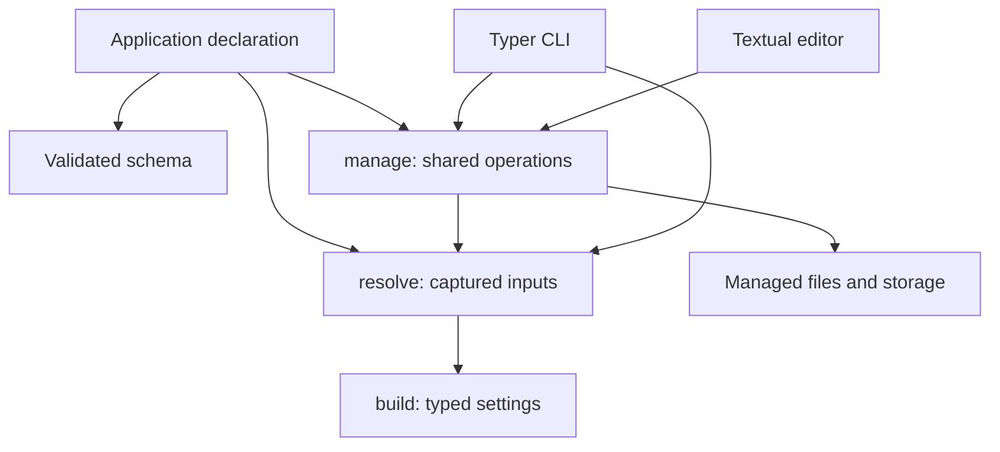

# AppRC architecture

[Manual](README.md) · [Recipes](How-To-User-Guides.md) · [Reference](References.md)

- [Declaration, resolution, and management](#declaration-resolution-and-management)
- [Capabilities and runtime requirements](#capabilities-and-runtime-requirements)
- [Why explicit snapshots](#why-explicit-snapshots)
- [Interfaces and shared operations](#interfaces-and-shared-operations)
- [Distribution ownership](#distribution-ownership)
- [Future desktop and build integrations](#future-desktop-and-build-integrations)

## Declaration, resolution, and management

`AppRC` is the application entrypoint. Its schema says which settings and
persistence capabilities exist. Runtime resolves inputs and constructs typed
objects. Management reads and writes the declared fixed layout. Interfaces
handle prompts, command arguments, and presentation.

Internal ownership follows those responsibilities:

| Area | Owns |
| --- | --- |
| `definition` | Metadata, validation rules, immutable source/origin records |
| `runtime/config` | Binding, constructors, copies, overrides, reloads |
| `runtime/resolution.py` | Source capture, precedence, and explicit construction |
| `user_files` | Dotenv/registry parsing, paths, writes, data-directory operations |
| `services` | Application-bound management and inspection |
| `interfaces` | Terminal input and output |
| `public` | The small application facade |

Declarations do not import persistence or interface implementations. Package
initializers contain imports and docstrings only. A section can be imported
directly without importing every other section or optional application package.

## Capabilities and runtime requirements

A user dotenv means "this app supports saved user overrides." Storage means
"this app supports named persistent data roots." They are independent. Existing
files cannot switch either capability on.

A run may need storage while another run of the same app does not. That belongs
in `ResolveOptions(storage_required=True)` or CLI runtime policy. Required field
values are a separate check. An application that declares a required storage-path
field must still provide it before constructing that section.

This avoids maintaining four application modes. The same loading and management
operations operate on whichever capabilities the declaration enables.

## Why explicit snapshots

Using `os.environ` as the intermediate result makes two applications or two
selected storages share mutable state. It also makes provenance depend on what
was loaded earlier in the process.

Each resolution now captures its own environment, layers, selection, and
registrations. `resolved.build()` passes that source directly into construction.
There is no environment swap, context-variable source, global origin registry,
or bootstrap cache. Concurrent resolutions retain separate values and origins.

A snapshot is immutable source data; constructed settings remain mutable Python
objects with explicit assignment and override behavior. The snapshot does not
freeze user code or filesystem state. A manager rereads files for each operation,
while existing runtime objects remain unchanged.

Environment export is useful for dependencies that demand it. It remains a
process-wide overlay, serialized only against other AppRC exports. It cannot
coordinate unrelated code writing `os.environ` or make environment-only consumers
retain file provenance.

## Interfaces and shared operations

The CLI and Textual editor use the same manager for setup, edits, storage
operations, migration, and purge. Inspection validates fields individually so
one invalid setting does not hide the rest. The editor presents captured sources
and explicit-file precedence from the resolver.

Three selections have different effects: browsing storage in the editor,
choosing storage for this invocation, and saving the registry default. Only a
selection operation changes the saved default.

Edit plans separate review from mutation. Revision checks reject a plan whose
file has changed. Unique temporary names prevent same-process collisions, and
atomic replacement avoids partial file contents. Neither mechanism makes a
multi-file or cross-process transaction. That limitation remains explicit in
[the TODO list](../TODO.md#todo-list).

## Distribution ownership

`apprc-core` owns the complete `apprc` Python tree and only the dependencies needed
for configuration and noninteractive management. `apprc` owns metadata and the
console entrypoint, and requires the matching core plus terminal dependencies.
Their wheels have no overlapping package files.

Both distributions use one version. Wrapper metadata is generated from the root
manifest and checked before building. Ordinary pip can build either source
archive without a workspace checkout or the uv command. The core uses the
[uv build backend](https://docs.astral.sh/uv/concepts/build-backend/); the wrapper
uses [explicit empty setuptools package discovery](https://setuptools.pypa.io/en/latest/userguide/package_discovery.html).

Keeping interface source in the core avoids two distributions owning the same
package namespace. Minimal installations must not import terminal implementations.
The public lazy namespaces defer those imports until the integration is used.

## Future desktop and build integrations

A Toga settings interface can reuse the declaration and manager. It should own
windows, widgets, prompts, and progress display. Cross-process coordination must
be completed before concurrent CLI/GUI editing is an expected supported workflow.

Centralized cx_Freeze tooling can know AppRC's resource and layout conventions.
It should own build configuration, resource inclusion, frozen smoke tests, and
installer assembly. Runtime and persistence should not import it or decide
installer behavior. The application owns its entrypoint and platform deployment
choices.

These are architectural boundaries for future work. This release adds no Toga
or cx_Freeze implementation, dependency, placeholder extra, or frozen-app
compatibility claim.
