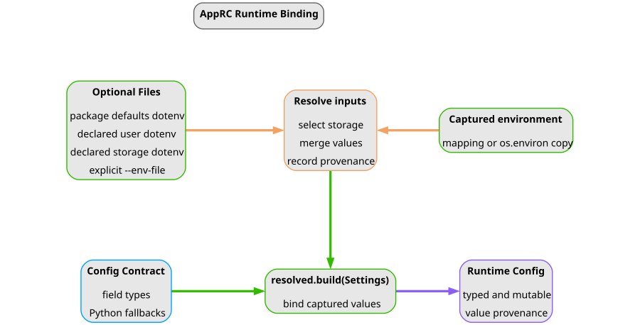
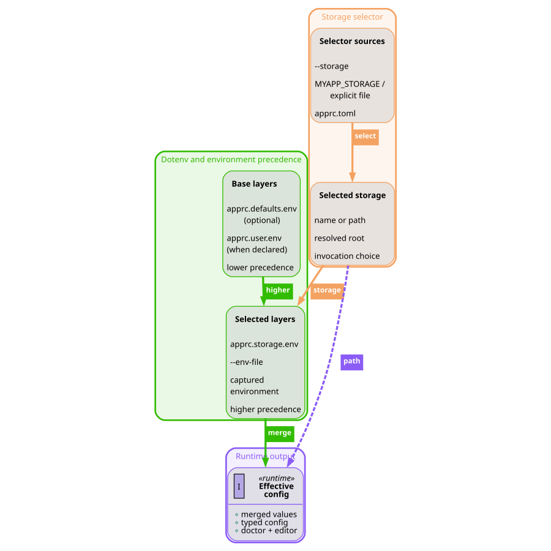
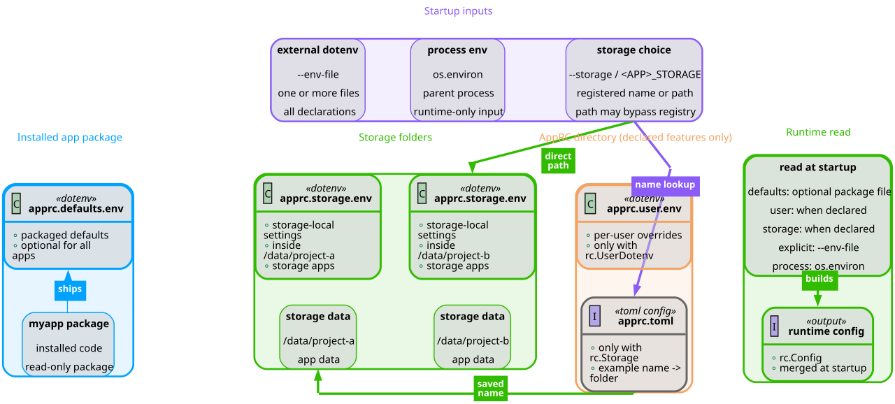

<!-- ======================================================== -->

 

## Table Of Contents
<!-- ======================================================== -->

1. [Explanations](#1-explanations)
2. [System Architecture](#2-system-architecture)
   1. [System Model](#system-model)
   2. [Integration Flow](#integration-flow)
   3. [Package Layout](#package-layout)
3. [Runtime Config Model](#3-runtime-config-model)
   1. [Config Contract Model](#config-contract-model)
   2. [Capability Layers](#capability-layers)
   3. [Runtime Bootstrap](#runtime-bootstrap)
   4. [Storage Selection](#storage-selection)
   5. [Zero-Write Policy](#zero-write-policy)
   6. [Provenance](#provenance)
4. [Generated Interfaces](#4-generated-interfaces)
   1. [Generated CLI](#generated-cli)
   2. [Textual Editor](#textual-editor)
   3. [Optional Logging](#optional-logging)
5. [Failure Model](#5-failure-model)

 

# 1. Explanations

Use this file when you need to understand why AppRC is shaped the way it is.
Use [How-To User Guides](How-To-User-Guides.md) for ordered recipes and
[References](References.md) for exact names.

 

# 2. System Architecture

<!-- ======================================================== -->

 

## System Model
<!-- ======================================================== -->

AppRC exists to keep application configuration from splitting into unrelated
systems. A host app declares its config contract once. AppRC then uses that
same contract for runtime binding, dotenv loading, validation, CLI setup,
diagnostics, editor rendering, and provenance.

The central objects are:

1. `EnvConfig` classes hold typed runtime values.
2. `@env_owner(...)` gives each class owner metadata: title, env prefix, and
   runtime config path.
3. `env_field(...)` gives each field metadata: env name, type, default,
   editability, secrecy, choices, and explanations.
4. `AppConfigKit` stores the application-level contract and selected
   persistence capabilities.
5. Bootstrap resolves layers and writes merged values into the current Python
   process environment.

|  |
|:--:|
| **Fig. 1 - Runtime Layers:** One config contract feeds runtime bootstrap, diagnostics, generated CLI commands, and the Textual editor. |

> [!NOTE]
> Related: use [declare typed config fields](How-To-User-Guides.md#declare-typed-config-fields)
> for the first integration step.

 

<!-- ======================================================== -->

 

## Integration Flow
<!-- ======================================================== -->

The normal host application flow is:

1. Declare one or more `EnvConfig` classes.
2. Add packaged defaults in `.env.shared`.
3. Create one `AppConfigKit`.
4. Bootstrap env layers at the CLI entrypoint.
5. Construct runtime config objects after bootstrap.
6. Mount the generated `config` CLI.

This order matters because `EnvConfig` reads from `os.environ` during object
construction. AppRC bootstrap is the step that merges packaged, app-wide,
storage, explicit env-file, and shell values into that process environment.

 

<!-- ======================================================== -->

 

## Package Layout
<!-- ======================================================== -->

Core AppRC areas:

| Area | Responsibility |
|---|---|
| `src/apprc/definition` | Developer-declared app specs, capability choices, env-backed config classes, owner metadata, and schema lookup. |
| `src/apprc/runtime` | Process-time dotenv bootstrap, provenance, and read-only diagnostics. |
| `src/apprc/user_files` | AppRC-managed config homes, dotenv editing, storage registries, archive helpers, and setup flows. |
| `src/apprc/interfaces` | Typer integration, generated `config` commands, CLI rendering, and Textual TUI presentation. |
| `src/apprc/logging` | Optional semantic logging and structlog-backed formatting. |
| `examples/apprc_example_app` | Runnable example host application. |
| `examples/example_apps` | Small executable examples for each AppRC capability mode and selector precedence. |
| `tests` | Behavior checks for public contracts and generated workflows. |
| `docs` | Long-form user, reference, explanation, and maintainer documentation. |

The root `apprc` facade re-exports normal integration APIs so applications can
use one import statement. More specialized modules remain importable for AppRC
internals, tests, and advanced debugging.

 

# 3. Runtime Config Model

<!-- ======================================================== -->

 

## Config Contract Model
<!-- ======================================================== -->

An AppRC contract has two levels.

`ConfigOwner` describes a group of related fields. It owns:

- a stable owner key such as `app`
- a human title such as `App`
- an env prefix such as `MYAPP_`
- a runtime config path such as `("app",)`
- ordered `ConfigField` metadata

`ConfigField` describes one setting. It owns:

- the Python attribute name
- the owner-local env variable name
- the Python type used for conversion
- default or required behavior
- secret redaction
- editability
- allowed choices
- short and long explanations

The host app writes normal dataclass-looking Python. AppRC derives the
normalized owner and field inventory from that code. The generated CLI and TUI
therefore do not need a separate schema file.

 

<!-- ======================================================== -->

 

## Capability Layers
<!-- ======================================================== -->

`AppConfigKit` constructors select which persistence capabilities exist:

| Constructor | Intended Shape |
|---|---|
| `env_only(...)` | Package defaults, explicit env files, and shell env only. |
| `storage_only(...)` | One required storage root, optional app-wide config, optional named-storage index. |
| `app_wide_config(...)` | A default app-wide dotenv without storage. |
| `app_wide_storage(...)` | A default app-wide dotenv plus one required storage root. |

The important distinction is "allowed" versus "active":

- A disabled layer never participates.
- An optional app-wide layer becomes active when `.env.apprc-app` exists.
- A default app-wide layer is expected and `config doctor` reports when it is
  missing.
- Optional named storage is used when the index file exists or when a named
  selector needs it.
- Storage is either disabled or required.

 

<!-- ======================================================== -->

 

## Runtime Bootstrap
<!-- ======================================================== -->

AppRC imports are side-effect free. Importing a config class does not read
dotenv files and does not mutate `os.environ`.

The host app calls bootstrap once near process startup. Bootstrap:

1. Captures the original process environment.
2. Reads explicit `--env-file` values.
3. Resolves app config-home paths.
4. Reads app-wide values when the app-wide layer is allowed and the file
   exists.
5. Selects storage when storage is required.
6. Reads packaged, app-wide, storage, and explicit dotenv layers.
7. Writes the merged values into this Python process only.
8. Registers provenance for app-owned env keys.

|  |
|:--:|
| **Fig. 2 - Runtime Layer Precedence:** AppRC merges lower-precedence defaults, app-wide config, storage config, explicit env files, and shell env into one typed runtime view. |

The parent shell is never changed.

 

<!-- ======================================================== -->

 

## Storage Selection
<!-- ======================================================== -->

Choosing storage answers one question: which directory owns the active
storage-local config and data for this run? The reference docs and public hook
names call this choice a `storage selector`.

AppRC checks possible storage choices in this order:

1. host-level `--storage`
2. storage env key, for example `MYAPP_STORAGE`
3. explicit env files, respecting `--env-file-overrides-os-environ`
4. app-wide `.env.apprc-app`, when active
5. packaged `.env.shared`

Storage choices can be written two ways:

| Value | Meaning |
|---|---|
| Path-like value | Use that path as the storage folder. This works without a saved address book. |
| Bare name | Resolve through `<app>.apprc.toml` when the storage address book exists. |

A bare unknown name fails when the storage address book exists and already
contains named storages. Use `./name` when a relative path is intended.

The location map below separates AppRC-owned dotenv files from runtime-only
inputs such as `--env-file` and shell variables.

|  |
|:--:|
| **Fig. 3 - AppRC Dotenv Locations:** AppRC-owned config files stand out from device locations, startup inputs stay separate, and the runtime-read box summarizes what AppRC reads when the app starts. |

 

<!-- ======================================================== -->

 

## Zero-Write Policy
<!-- ======================================================== -->

AppRC separates inspection from creation. Runtime reads and diagnostics should
be safe on a machine that has never run setup.

Zero-write operations include:

- runtime bootstrap
- `config paths`
- `config doctor`
- opening `config edit`
- storage selector resolution

Explicit write operations include:

- `config setup`
- `config app init`
- `config set`
- saving from `config edit`
- `config storage add`
- `config storage remove`

This policy makes first-run diagnostics useful: AppRC can tell a user which
files would be used without silently creating empty files that look like a real
configuration.

 

<!-- ======================================================== -->

 

## Provenance
<!-- ======================================================== -->

Runtime config objects can report why a value is effective. Provenance tracks
whether a value came from Python code, a shell-side source, or a runtime
mutation.

Examples of exact origins include:

- `python_constructor_argument`
- `python_envconfig_default`
- `python_runtime_assignment`
- `python_scoped_override`
- `shell_dotenv_shared`
- `shell_dotenv_app_wide`
- `shell_dotenv_storage`
- `shell_dotenv_explicit`
- `shell_export_variable`

Secret fields keep their real value for runtime use but show a redacted
display value in provenance and UI surfaces.

 

# 4. Generated Interfaces

<!-- ======================================================== -->

 

## Generated CLI
<!-- ======================================================== -->

`mount_config_cli(...)` is the shortest Typer integration path: it registers
standard AppRC host-level options, runs bootstrap only for commands that need
runtime state, and mounts the generated `config` group. It keeps AppRC bootstrap
context separate from app-owned `ctx.obj` state, so bootstrapless config commands
can run without constructing incomplete application state.

`AppConfigKit.typer_app(...)` builds only the reusable Typer command group. The
group is generated from the app spec, so unavailable capabilities are not
exposed. `ConfigCliBridge` is the middle layer for apps that own their host
callback and extra options: the bridge prepares AppRC context, applies skip
policy, mounts the generated group, and validates app-owned state. Apps that
only need custom state after bootstrap can keep the mount helper and pass
`state_type=...` plus `state_factory=...`. Apps that need a non-default generated
group name can pass `config_group_name=...`. Apps that need app-owned hooks to
run for generated writes can pass `bootstrap_policy=...` or use the bridge
directly.
When `ConfigCliBridge.prepare(...)` skips runtime bootstrap, the returned
session has `skipped_runtime_bootstrap=True` and `state=None`; existing
host-owned `ctx.obj` values are left alone. When bootstrap runs, runtimeful
generated config commands expect the host callback to leave the declared
`state_type` on `ctx.obj`; AppRC reports a clear error if that state is missing.
Generated config group mounting also fails early when the host app already owns
the requested command or group name.

The CLI has three jobs:

1. Inspect current state: `paths`, `doctor`, `show`.
2. Initialize explicit files: `setup`, `app init`, `storage add`.
3. Edit values: `set`, `edit`, `storage remove`.

Some config commands intentionally skip full runtime bootstrap. That lets users
run setup and diagnostics before required runtime settings exist.

 

<!-- ======================================================== -->

 

## Textual Editor
<!-- ======================================================== -->

The Textual editor is another view over the same config contract. It renders
owner sections and fields, shows source columns, validates values through the
same type metadata, and writes only the selected dotenv scope.

The editor does not create files on open. It creates files only when the user
saves to a writable app-wide or storage scope.

Named-storage controls are available only when named storage is enabled and an
index is loaded. Direct path-selected storage editing works without an index.

 

<!-- ======================================================== -->

 

## Optional Logging
<!-- ======================================================== -->

AppRC logging is a companion feature, not required for runtime config. The
base semantic logger API is stdlib-compatible. The `setup_logging()` formatter
path uses `structlog` and therefore requires the `logging` extra.

Use `get_logger(name)` for AppRC semantic methods such as `success` and
`traceback`. Call `install_app_logger_class()` before external code creates
plain stdlib loggers for names that should later use AppRC logger methods.

 

# 5. Failure Model

When an AppRC-backed app is not runnable, check in this order:

1. Run `myapp config paths --json` to see paths and capabilities without
   treating missing setup as a failure.
2. Run `myapp config doctor --json` to see the readiness status.
3. Confirm required selectors such as `MYAPP_STORAGE`.
4. Confirm selected storage roots exist.
5. Confirm expected dotenv files exist.
6. Confirm named selectors match the named-storage index.
7. Confirm explicit env-file override policy when shell exports and
   `--env-file` disagree.

`config doctor` statuses are intentionally coarse. The payload's `issues`,
`warnings`, and `next_steps` fields carry the specific repair path.

> [!NOTE]
> Related links:
> - Use [Troubleshoot Config Doctor](How-To-User-Guides.md#troubleshoot-config-doctor)
>   for repair recipes.
> - Use [Doctor Statuses](References.md#doctor-statuses) for the exact status
>   vocabulary.
