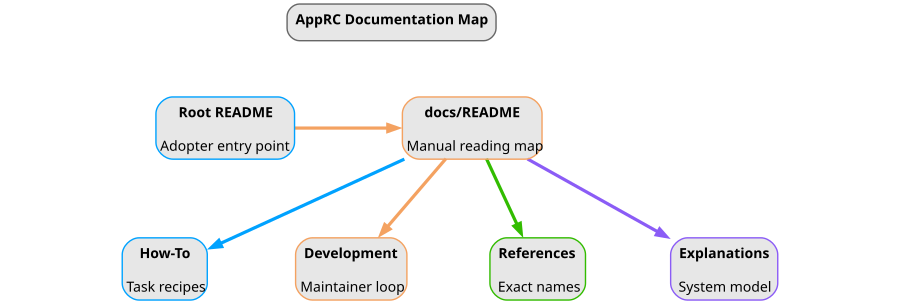

<!-- ======================================================== -->

 

## Table Of Contents
<!-- ======================================================== -->

1. [Using These Docs](#1-using-these-docs)
   1. [What Lives Here](#what-lives-here)
   2. [Reading Map](#reading-map)
   3. [Repository Terms](#repository-terms)

 

# 1. Using These Docs

<!-- ======================================================== -->

 

## What Lives Here
<!-- ======================================================== -->

This directory is the long-form manual for AppRC. The root
[README](../README.md) stays short enough for package discovery and first
integration. These files hold task recipes, exact reference names, system
explanations, and maintainer workflow.

|  |
|:--:|
| **Fig. 1 - Documentation Reading Map:** Start at the root README, then move into the docs file that matches the job: recipe, maintainer workflow, exact names, or system model. |

> [!NOTE]
> Related: use [How-To User Guides](How-To-User-Guides.md) for commands in
> order, [References](References.md) for exact names, and
> [Explanations](Explanations.md) for why AppRC behaves as it does.

 

<!-- ======================================================== -->

 

## Reading Map
<!-- ======================================================== -->

- **[How-To User Guides](How-To-User-Guides.md):** recipes for integrating
  AppRC into an app, setting up storage, editing values, and diagnosing setup.
- **[Explanations](Explanations.md):** the system model behind config owners,
  capability layers, bootstrap, storage selection, provenance, CLI, and TUI.
- **[References](References.md):** exact public imports, constructor modes,
  CLI commands, env vars, filenames, precedence rules, and status names.
- **[Development](Development.md):** maintainer workflow, documentation
  generation, local verification, and repo-specific documentation rules.

Recommended reading paths:

| Goal | Start Here | Then Read |
|---|---|---|
| Add AppRC to an app | [README](../README.md) | [How-To User Guides](How-To-User-Guides.md) |
| Understand the design | [Explanations](Explanations.md) | [References](References.md) |
| Debug a user's setup | [How-To User Guides](How-To-User-Guides.md#troubleshoot-config-doctor) | [Doctor Statuses](References.md#doctor-statuses) |
| Check an exact API name | [References](References.md) | Source files linked from that section |
| Change this repo | [Development](Development.md) | [AGENTS.md](../AGENTS.md) |

> [!NOTE]
> Related links:
> - Use [Development: documentation rules](Development.md#documentation-rules)
>   before changing docs structure or callout/link conventions.
> - Use [References: documentation assets](References.md#documentation-assets)
>   before changing documentation figures.

 

<!-- ======================================================== -->

 

## Repository Terms
<!-- ======================================================== -->

Use these terms consistently in every docs file:

| Term | Meaning | Main Reference |
|---|---|---|
| AppRC | This package, `apprc`, which supplies runtime config, generated config CLI, and Textual editor helpers. | [System Model](Explanations.md#system-model) |
| application | The downstream Python app that integrates AppRC. | [Integration Flow](Explanations.md#integration-flow) |
| config contract | The `EnvConfig` classes plus the `AppConfigKit` spec for one application. | [Config Contract Model](Explanations.md#config-contract-model) |
| config owner | A related group of settings declared with `@env_owner(...)`. | [Public Interfaces](References.md#public-interfaces) |
| config field | One typed setting declared with `env_field(...)`. | [Public Interfaces](References.md#public-interfaces) |
| capability layer | A persistence feature selected by the `AppConfigKit` constructor. | [Capability Constructors](References.md#capability-constructors) |
| app-wide dotenv | The per-user `.env.apprc-app` file below the platform config home. | [Configuration Files](References.md#configuration-files) |
| storage dotenv | The `.env.apprc-storage` file inside one selected storage root. | [Configuration Files](References.md#configuration-files) |
| named-storage index | The optional `<app>.apprc.toml` registry for named storage roots. | [Storage Selection](Explanations.md#storage-selection) |
| zero-write read | A command or runtime operation that inspects config without creating files. | [Zero-Write Policy](Explanations.md#zero-write-policy) |
